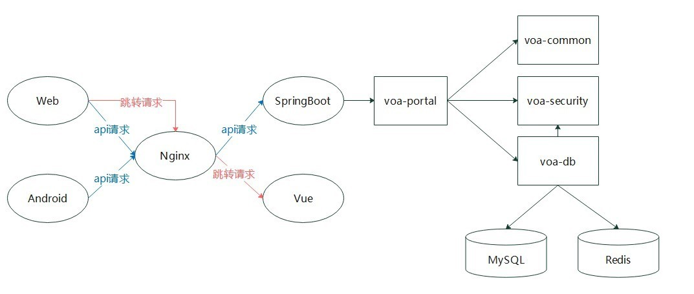
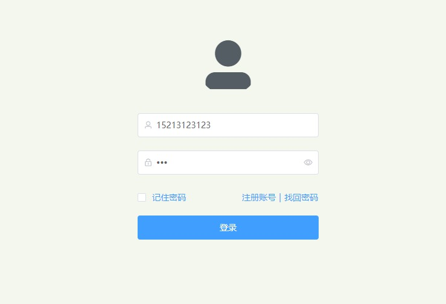
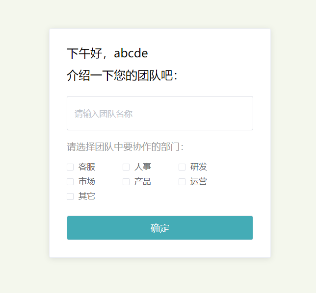
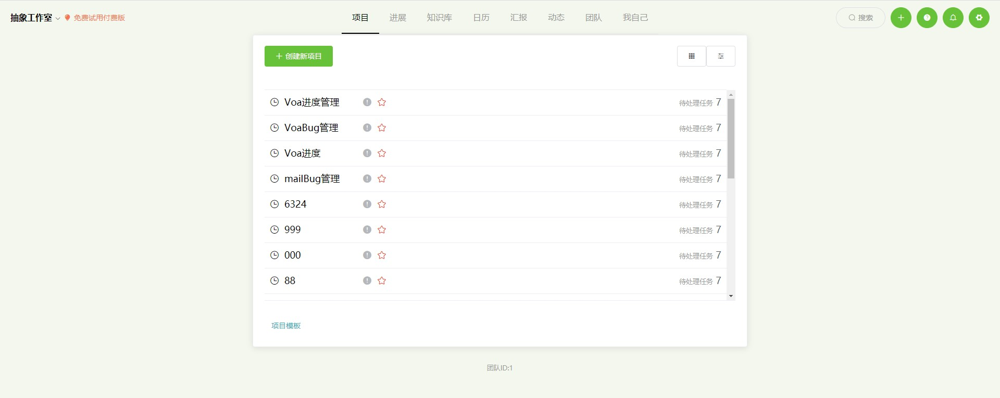
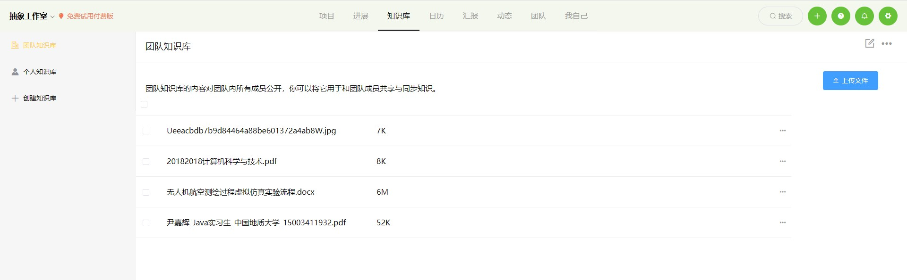
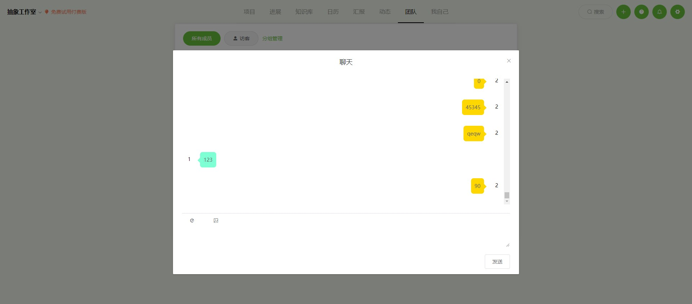
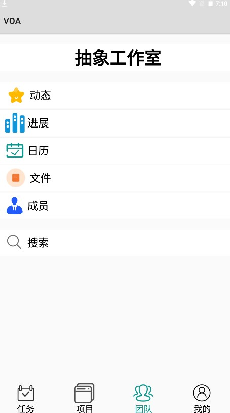

### 项目介绍

#### 个人博客项目

地址：[博客](https://blog.yinjiahui.cn)

该博客网站是本人独立进行后端开发的项目，实现了在线 Markdown 文章编辑、后台管理、前台文章展示、留言、搜索等功能。 后端使用 SpringBoot 搭建，使用 SpringSecurity 作为安全框架实现用户登录。 使用 Redis 缓存热点数据。采用 MySQL 进行数据存储。 使用 Elasticsearch 存储文档并构建倒排索引，实现文章搜索功能。

#### 课程售卖系统

课程售卖系统使用了KiteX框架，实现了课程发布、售卖、账户管理等功能。整个项目分为4个模块：课程模块、用户模块、售卖模块、API接入模块，模块间通过RPC进行调用。

+ 在课程模块及用户模块使用了Redis实现了分布式锁，保证了数据一致性。
+ 所有模块完成压测、单测。
+ 该项目获得字节跳动新人训练营优秀奖。

#### CVPR数据可视化

地址：[数据可视化](https://dv.yinjiahui.cn)

这是数据可视化课程的结课作业，我爬取了CVPR近7年的数据并做了一些简单的统计，然后做成了可视化网页。

#### 企业协同软件

该项目是本人独立负责后端开发，可在Android和网页上进行团队管理，任务管理，即时通讯等。

本项目使用了前后端分离的开发模式。前端分为Web端及Android端，方便用户通过电脑及手机访问。后端采用Nginx服务器进行请求转发，主要框架使用了SpringBoot。

Web端及Android端使用JWT进行登录认真，并通过相同的接口进行请求，做到数据一致。Nginx服务器将api请求转发到SpringBoot服务，将跳转请求转发到Vue项目，做到了动静分离及反向代理。

             
Web登陆界面
 

             
新建团队
 

             
Web主页
 

             
知识库
 

             
聊天界面
 

             
Android主页
 

